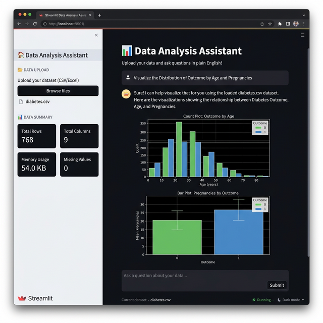

# 📊 LLM-Powered Data Analysis App

An interactive data analysis assistant built with **Streamlit** and **OpenAI GPT-4.1**. Upload any CSV file and ask questions about your data in plain English — get instant insights, statistics, and visualizations.



## ✨ Features

- **Natural Language Queries** — Ask questions about your data in plain English, no coding required
- **Auto Visualization** — Automatically generates charts and plots using Matplotlib & Seaborn
- **Smart Data Summary** — Displays key metrics (rows, columns, memory usage, missing values) at a glance
- **Conversation Memory** — Maintains context across multiple questions for follow-up analysis
- **Code Execution** — Runs generated Python code in a sandboxed environment with error handling
- **Export Reports** — Download your analysis as an HTML report
- **Token Optimization** — Efficiently handles large datasets by sending summaries instead of full data

## 🛠️ Tech Stack

| Technology | Purpose |
|---|---|
| [Streamlit](https://streamlit.io/) | Web UI framework |
| [OpenAI GPT-4.1](https://openai.com/) | LLM for natural language understanding |
| [Pandas](https://pandas.pydata.org/) | Data manipulation |
| [Matplotlib](https://matplotlib.org/) | Visualization |
| [Seaborn](https://seaborn.pydata.org/) | Statistical visualization |

## 🚀 Getting Started

### Prerequisites

- Python 3.9+
- OpenAI API key

### Installation

1. **Clone the repository**
   ```bash
   git clone https://github.com/merttdmrr/LLM-Data-Analysis-App.git
   cd LLM-Data-Analysis-App
   ```

2. **Create a virtual environment**
   ```bash
   python -m venv .venv
   source .venv/bin/activate   # macOS/Linux
   .venv\Scripts\activate      # Windows
   ```

3. **Install dependencies**
   ```bash
   pip install -r requirements.txt
   ```

4. **Set up your API key**

   Create a `.streamlit/secrets.toml` file:
   ```toml
   OPENAI_API_KEY = "your-openai-api-key-here"
   ```
   > ⚠️ This file is in `.gitignore` and will **not** be pushed to GitHub.

5. **Run the app**
   ```bash
   streamlit run app.py
   ```

   The app will open at `http://localhost:8501`

## 📁 Project Structure

```
LLM-Data-Analysis-App/
├── app.py                # Main Streamlit application
├── requirements.txt      # Python dependencies
├── sample-data/          # Sample CSV files for testing
│   ├── diabetes.csv
│   └── sample_data.csv
├── .streamlit/
│   └── secrets.toml      # API keys (not tracked by git)
├── screenshots/
│   └── app_demo.png
├── .gitignore
└── README.md
```

## 💡 Example Questions

Once you upload a CSV file, try asking:

- *"What are the main trends in my data?"*
- *"Show me a correlation matrix"*
- *"Create a bar chart of the top 10 categories"*
- *"What's the average value by month?"*
- *"Are there any outliers in the price column?"*

## 🔒 Security

- API keys are stored in `.streamlit/secrets.toml`, which is excluded from version control
- Your uploaded data is processed locally and is not stored on any server

## 📄 License

This project is licensed under the [MIT License](LICENSE).

## 🤝 Contributing

Contributions are welcome! Feel free to open issues or submit pull requests.
